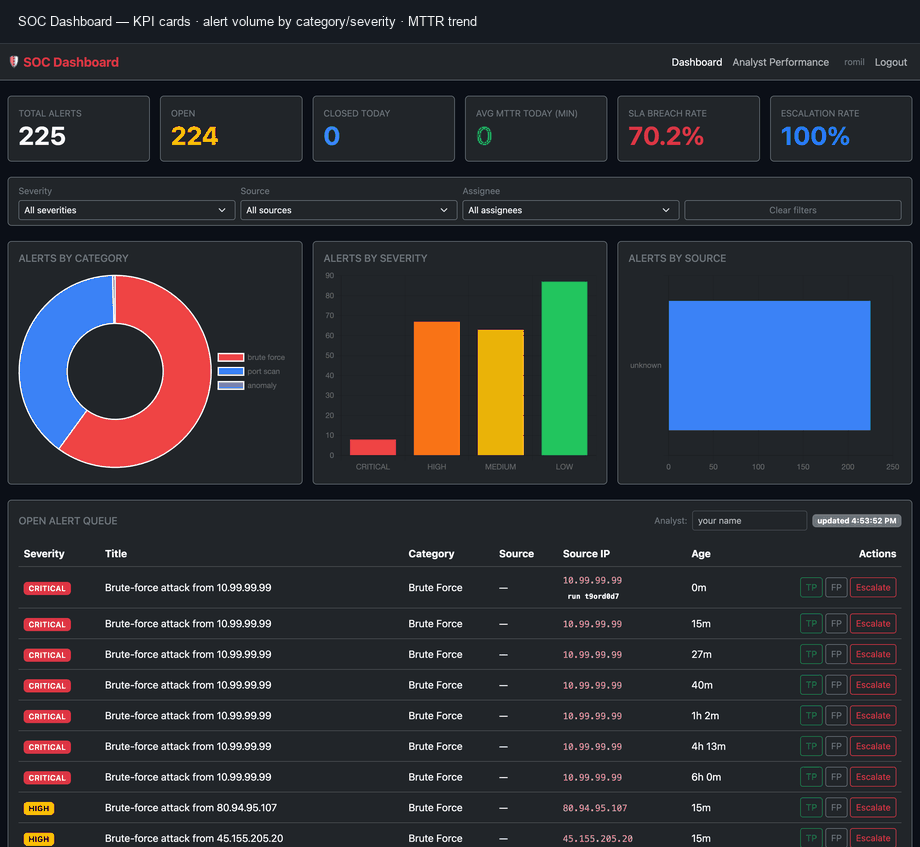

# SOC Dashboard

SOC Dashboard is a Flask and PostgreSQL web app for triaging security alerts. It takes alerts over a REST API (log-analyzer pushes them, though any tool sending the right JSON works), holds them in a severity-ranked queue, and lets an analyst mark each one true positive, false positive, or escalation in a single click. It timestamps every action and turns those into SOC KPIs (MTTR, SLA-breach rate, escalation rate) drawn with Chart.js. It is the triage stage of a two-part pipeline: [log-analyzer](https://github.com/Romil2112/log-analyzer) detects the incidents, SOC Dashboard is where a person works them.

## Screenshots

Main dashboard: severity KPIs, category / severity / source charts, and the open-alert queue.


The alert queue, with one-click triage on every alert.


Analyst performance and the MTTR trend over the week.


Dashboard walkthrough — KPI cards, alert queue with one-click triage, and analyst performance view:



## How it works

Alerts reach the dashboard two ways and both land in one queue. A detector POSTs to the ingest endpoint with an API key; analysts sign in and work the queue in the browser. Every read and write goes through one PostgreSQL database holding three tables (alerts, analyst_actions, users), and `/api/stats` aggregates that into the charts and the SLA and MTTR numbers.

Security sits on a few specific choices. The ingest endpoint checks its API key with a constant-time comparison, so response timing does not reveal how much of the key was right. Analyst passwords are stored as bcrypt hashes and there is no self-registration: accounts are created from the CLI. Session routes sit behind CSRF protection, while the machine-to-machine ingest route is exempt because it authenticates by key rather than by cookie. Errors return JSON with a fixed message and no stack trace, so a failed request does not leak internal file paths.

`/api/stats` was the slow path. The stats endpoint used to run a correlated subquery once per alert row; I replaced it with a single aggregate join and the query went from 24ms to 12ms at 20,000 alerts. The rewrite scans analyst_actions once and LEFT JOINs it to alerts instead of re-querying per row, and the SLA and MTTR values it returns are unchanged.

## Features

- Severity-ranked alert queue (CRITICAL down to LOW) with one-click triage
- REST ingest API guarded by a constant-time `X-API-Key` check
- Flask-Login analyst auth, bcrypt-hashed passwords, no self-registration
- CSRF protection on session routes; JSON error handlers with no stack-trace leaks
- SOC KPIs: MTTR per analyst, SLA-breach rate per severity target, escalation rate
- Live filters by severity, detection source, and assignee that drive both the queue and the charts
- Chart.js views: alerts by category, by severity, by source, and a 7-day MTTR trend
- Fernet field-level encryption at rest for `title`, `source_ip`, and `description`
- Configurable retention purge (`ALERT_RETENTION_DAYS`)
- 50 pre-seeded demo alerts across 5 categories, 4 severities, and 5 detection sources
- 75 pytest tests at 95% line / 92% branch coverage, run against a real PostgreSQL

## Running the Project

**Prerequisites:** Python 3.12+ and PostgreSQL 14+.

**1. Set up a virtual environment**

```bash
python3 -m venv .venv
source .venv/bin/activate        # Windows: .venv\Scripts\activate
pip install -r requirements.txt
```

**2. Create and seed the database**

```bash
createdb soc_dashboard
psql soc_dashboard -f schema.sql
python seed.py        # loads 50 demo alerts across 5 categories and severities
```

**3. Configure secrets**

```bash
cp .env.example .env
```

Open `.env` and set the two required values. Generate each with `python -c "import secrets; print(secrets.token_hex(32))"`:

```
FLASK_SECRET_KEY=<generated>    # required — app refuses to start without it
ALERTS_API_KEY=<generated>      # required — ingest endpoint rejects requests without it
DB_ENCRYPTION_KEY=<generated>   # optional — enables Fernet encryption of PII fields
```

**4. Create an analyst account**

There is no sign-up page; all accounts are created from the CLI:

```bash
python manage.py create-user alice 's0me-strong-passphrase' --role analyst
# use --role admin for full access
```

**5. Start the app**

```bash
python app.py
```

Open <http://localhost:8000> and sign in with the credentials you created. The main dashboard loads immediately with the seeded demo alerts.

**With Docker Compose** (PostgreSQL + Flask in one command)

```bash
docker compose up
```

The `docker-compose.yml` starts PostgreSQL, runs the schema migration, and starts Flask — no separate database setup required. It still needs `FLASK_SECRET_KEY` and `ALERTS_API_KEY` set in `.env`.

## API reference

| Method | Endpoint | Description |
|--------|----------|-------------|
| GET | `/` | Main dashboard |
| GET | `/analyst` | Analyst performance page |
| GET | `/api/alerts` | Open alerts sorted by severity. Filterable: `?severity=&source=&assigned_to=` |
| GET | `/api/alerts/all` | All alerts. Same filter query params as above |
| POST | `/api/alerts` | **Ingest** a new alert `{title, category, severity, source?, source_ip?, description?}` → 201 |
| POST | `/api/alerts/<id>/classify` | Classify alert `{analyst, action}` |
| GET | `/api/stats` | Summary counts + `by_category` / `by_severity` / `by_source` + `escalation` + `sla` + MTTR by analyst + `assignees` |

`action` is one of `classify_tp` (→ `true_positive`), `classify_fp` (→ `false_positive`),
or `escalate` (→ `escalated`). Filter query params are validated against a column
whitelist, so they compose into parameterized SQL safely (no injection surface).

### Environment variables

Copy `.env.example` to `.env` and fill these in. The two required ones make the app refuse to start (or refuse ingest) if missing; the rest have safe defaults.

| Variable | Required | Default | Purpose |
|---|---|---|---|
| `FLASK_SECRET_KEY` | yes | — | Signs analyst login sessions; app won't start without it |
| `ALERTS_API_KEY` | for ingest | — | `X-API-Key` that `POST /api/alerts` checks (constant-time) |
| `DATABASE_URL` | — | `postgresql://localhost/soc_dashboard` | PostgreSQL connection string |
| `DB_ENCRYPTION_KEY` | — | unset (plaintext) | Enables Fernet encryption of title/source_ip/description at rest |
| `ALERT_RETENTION_DAYS` | — | `0` (keep forever) | Purge alerts older than N days at startup |
| `FLASK_DEBUG` | — | off | Set `1`/`true` for the Werkzeug debugger (local dev only) |
| `HOST` / `PORT` | — | `127.0.0.1` / `8000` | Bind address and port for `python app.py` |

## Architecture diagram

Two ways alerts arrive, one queue they land in. A detector (log-analyzer, or any tool) pushes alerts over the API-key-protected ingest endpoint; analysts sign in, work the queue, and classify each alert, which records an action and its response time. Everything reads and writes one PostgreSQL database, and the stats endpoint aggregates it into the charts and the SLA/MTTR numbers on the dashboard.

```mermaid
flowchart LR
    D[Detector<br/>e.g. log-analyzer] -->|POST /api/alerts<br/>X-API-Key| ING[Ingest]
    A[Analyst<br/>browser] -->|login session| WEB[Dashboard + queue]
    ING --> DB[(PostgreSQL<br/>alerts · analyst_actions · users)]
    WEB -->|classify / escalate| DB
    DB --> STATS[/api/stats<br/>counts · MTTR · SLA · escalation]
    STATS --> CHARTS[Chart.js dashboard]
    subgraph Security
        CSRF[CSRF on session routes]
        ENC[Fernet field encryption at rest]
    end
```

## Tests

75 pytest tests cover the ingest API, auth and CSRF, RBAC roles, the classify/escalate flow, the KPI math (MTTR, SLA, escalation), the filter query params, encryption at rest, audit trail, SSE live updates, and the seed and user-management CLIs, at 95% line and 92% branch coverage. They run against a real PostgreSQL database through a Flask test client, both locally and on GitHub Actions with a Postgres service container. Point `DATABASE_URL` at a throwaway database and run:

```bash
python -m pytest tests/ -v
```

## Skills Demonstrated

| Skill | Details |
|---|---|
| SOC Workflow | RBAC (viewer/analyst/admin), atomic audit trail with encrypted case notes, Server-Sent Events for live queue updates, quick filter presets |

## Roles & Permissions

SOC Dashboard has three roles, enforced server-side on every protected route:

| Role | Permissions |
|---|---|
| **viewer** | Read-only: dashboard, alert queue, charts, KPIs. Cannot triage, escalate, or add notes. |
| **analyst** | Everything viewer can do, plus: triage alerts (TP/FP/escalate), add case notes. |
| **admin** | Everything analyst can do, plus: view and search the audit log, manage users. |

Create accounts from the CLI:

```bash
python manage.py create-user alice 'passphrase' --role analyst
python manage.py create-user bob   'passphrase' --role viewer
python manage.py create-user carol 'passphrase' --role admin
```

Existing analyst and admin accounts continue to work identically — no migration required. Apply the new schema (which adds `audit_log`) with:

```bash
psql soc_dashboard -f schema.sql
```

## Audit Trail

Every status change (triage, escalate, reclassify) and case note is recorded in the `audit_log` table **atomically** with the alert update — if the alert write fails, the audit row is rolled back too.

**Case notes:**
```bash
curl -X POST http://localhost:8000/api/alerts/42/notes \
  -H "Content-Type: application/json" \
  -b "session=..." \
  -d '{"note": "Confirmed C2 callback — escalating to IR."}'
```

**Audit history for an alert:**
```
GET /api/alerts/<id>/audit   →  JSON array of audit entries
```

**Full audit log** (admin only):
```
GET /audit   →  searchable, paginated HTML page
```

Note text is encrypted at rest with the same Fernet key as other PII fields (`DB_ENCRYPTION_KEY`).

## Real-Time Updates

The dashboard connects to a Server-Sent Events (SSE) stream at `GET /api/stream`. When a new alert is ingested or an alert's status changes, the queue table and KPI cards update live without a page refresh.

The existing 30-second polling loop remains active as a fallback — SSE is the primary path; if the `EventSource` connection fails, polling keeps the queue current.

**Limitation:** the in-process pub/sub only works within a single Gunicorn worker. For multi-worker production deployments, replace `_sse_publish`/`_sse_subscribe` with a Redis pub/sub adapter. The current implementation is correct and sufficient for single-worker or development deployments.

## Saved Filter Views

Quick-filter preset buttons above the alert queue let an analyst jump to common views in one click:

| Preset | Shows |
|---|---|
| **My Queue** | Open alerts assigned to the current analyst (uses localStorage name) |
| **Critical Today** | Open CRITICAL alerts created today (uses `created_after` param) |
| **Escalated** | All alerts with status = escalated |
| **All Open** | The default open queue |

These presets combine with the existing severity/source/assignee filters. The underlying `/api/alerts` endpoint now accepts a `created_after` ISO datetime parameter alongside the existing filter params.

## ⚖️ Legal Notice & Responsible Use

This project is **free and open-source software**, released under the **MIT License** as a
**demonstration / learning / trial project**. It is provided **"as is", without warranty of
any kind**, and is **not an audited or certified commercial security product**.

- **Authorized use only.** Use it solely on systems, networks, and data that you own or are
  **explicitly authorized** to operate and analyze.
- **Do no harm.** Do not use it to surveil, stalk, harass, invade the privacy of, or conduct
  unauthorized monitoring of any person or organization.
- **Compliance is the operator's responsibility.** Alert data may include IP addresses and
  other details that qualify as personal data. Compliance with **GDPR, CCPA, HIPAA, and
  equivalent laws** — where applicable — rests with the operator.
- **Misuse may be illegal.** Unauthorized access to or monitoring of computer systems may
  violate laws such as the U.S. **CFAA**, the UK **Computer Misuse Act**, and EU
  information-systems directives.

By using this software you accept responsibility for operating it lawfully. See
[SECURITY.md](SECURITY.md) to report a vulnerability.

## License

MIT — see [LICENSE](LICENSE).
