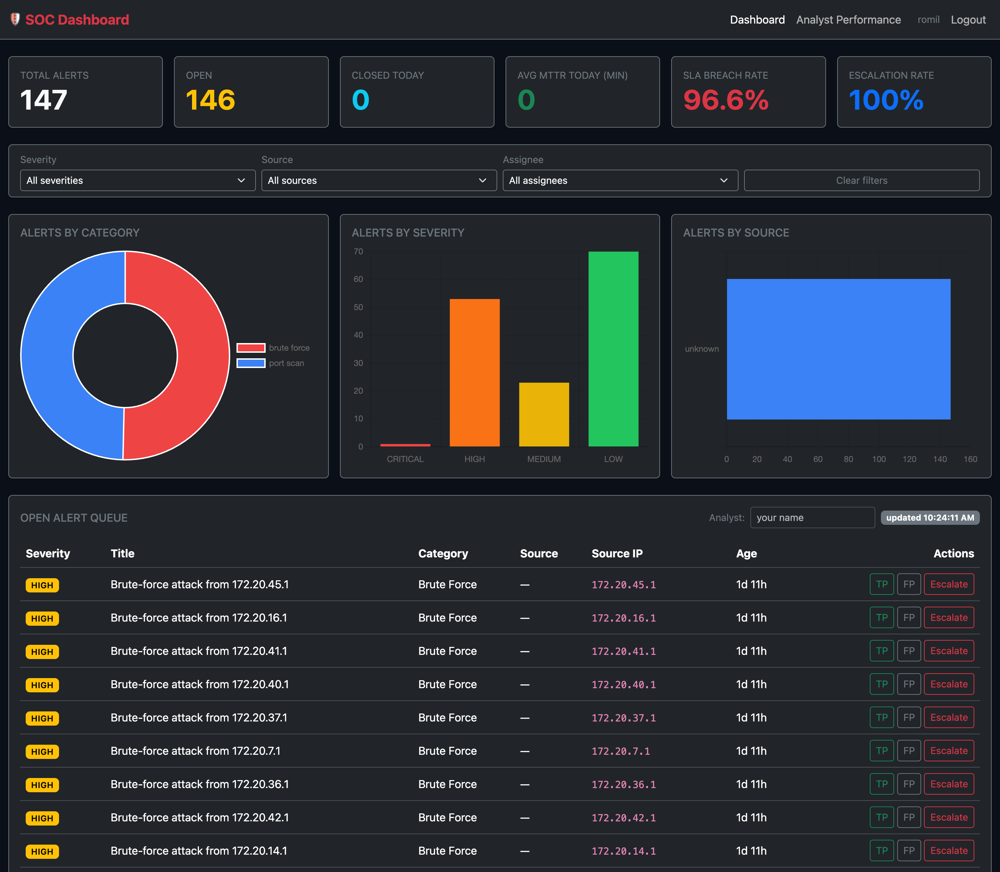
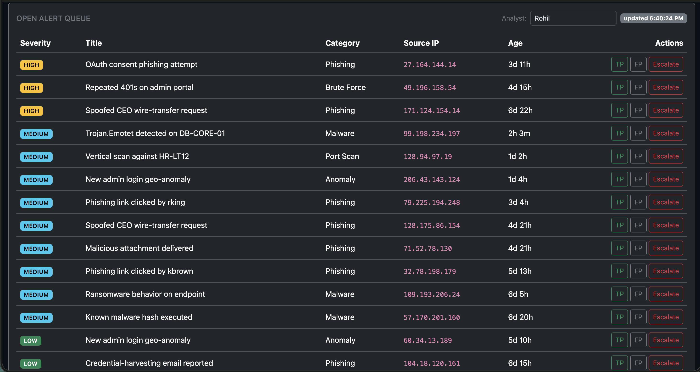
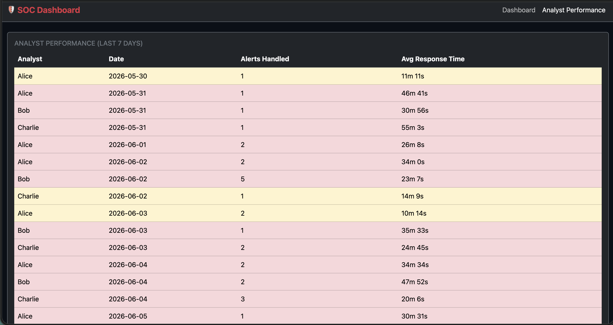
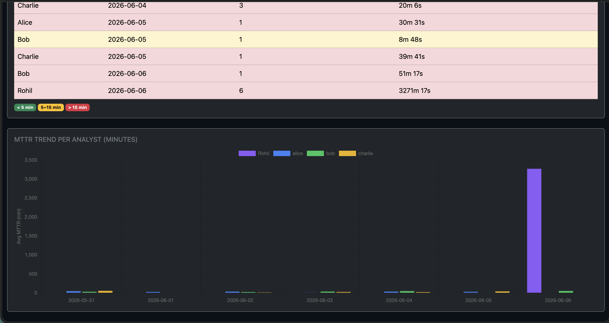

# SOC Dashboard

Flask-based Security Operations Center analyst dashboard with a real-time alert queue, SOC KPIs (MTTR, SLA-breach rate, escalation rate), interactive filters, and Chart.js visualizations.


## Overview

**SOC Dashboard** is a triage console for security analysts. It surfaces security
alerts from a PostgreSQL database in a live, severity-ranked queue and lets analysts
classify each alert as a true positive, false positive, or escalation with a single
click. Every action is timestamped, so the system continuously measures **MTTR**
(mean time to resolve) per analyst and visualizes both the alert landscape and team
performance with Chart.js. The goal is to model the day-to-day workflow of a real SOC
analyst — what's in my queue, what's most urgent, and how fast is the team responding?

In a complete detection-and-response pipeline, this project is the **triage layer**.
It pairs with [**log-analyzer**](https://github.com/Romil2112/log-analyzer), the
**detection layer**, which ingests SSH `auth.log` files and runs both sliding-window
rule detection and an Isolation Forest ML model to generate alerts. Those alerts are
exactly the kind of events that land in this dashboard's queue. Together the two
projects demonstrate the full SOC pipeline: **Ingest → Detect → Triage → Respond.**

The intended users are **Tier 1 / Tier 2 SOC analysts** triaging incoming alerts, and
**SOC team leads / managers** who use the analyst-performance view to monitor MTTR
KPIs, spot bottlenecks, and understand workload distribution across the team. Dashboard
access requires an analyst login (accounts are created via `manage.py`; see
[Authentication & Security](#authentication--security)), while machine-to-machine alert
ingest is protected by an API key.

## Features

- **Real-time alert queue** pulled from PostgreSQL, sorted by severity (CRITICAL → LOW)
- **One-click triage:** True Positive / False Positive / Escalate buttons per alert
- **Analyst authentication** via Flask-Login with bcrypt-hashed passwords (no self-registration; accounts created via `manage.py`)
- **Field-level encryption at rest** (optional) for alert title / source IP / description, plus API-key-protected ingest and configurable retention
- **MTTR tracking** per analyst per day, with a 7-day trend chart
- **SLA breach tracking:** per-severity response targets (CRITICAL 15m → LOW 24h) with a live breach-rate KPI
- **Escalation-rate KPI:** share of triaged alerts escalated to incident response (`escalated / triaged`)
- **Interactive filters:** filter the queue *and* the charts live by **severity**, **detection source**, and **assignee** (server-side, injection-safe query params)
- **Detection-source dimension:** every alert carries the sensor that raised it (EDR, Firewall/IDS, Email Gateway, Auth Logs, SIEM/UEBA)
- **Color-coded performance table:** green &lt; 5 min, yellow 5–15 min, red &gt; 15 min
- **Alerts by category** doughnut chart (brute force, malware, phishing, port scan, anomaly)
- **Alerts by severity** bar chart (CRITICAL / HIGH / MEDIUM / LOW)
- **Alerts by source** horizontal bar chart across detection sensors
- **Auto-refresh every 30 seconds** via JavaScript polling
- **50 pre-seeded realistic alerts** across 5 categories, 4 severity levels, and 5 detection sources
- **Docker support:** `docker compose up` starts Flask + PostgreSQL together
- **MIT Licensed**

## Screenshots

**Main dashboard — stat cards and charts**



**Open alert queue — severity badges and action buttons**



**Analyst performance — MTTR table and trend chart**



**MTTR trend per analyst — 7-day bar chart**



## Skills Demonstrated

| Area | Details |
|------|---------|
| Flask / Python | REST API design, route handling, psycopg2 direct DB access, no ORM |
| PostgreSQL | Schema design, JSONB-ready tables, timestamp-based MTTR aggregation |
| JavaScript | Fetch API polling, localStorage, dynamic DOM updates, Chart.js integration |
| Bootstrap 5 | Responsive dark-themed UI, badge system, card layout |
| SOC Domain Knowledge | Alert triage workflow, MTTR + SLA-breach + escalation-rate KPIs, severity classification, detection-source attribution, analyst performance tracking |
| Data Filtering | Server-side, injection-safe filtering (whitelisted columns) driving both the queue and the charts |
| Testing / CI | 34 pytest tests (Flask test client + PostgreSQL) run via GitHub Actions with a Postgres service container |
| Security | Flask-Login analyst auth (bcrypt, 12 rounds), API-key-protected ingest, Fernet field-level encryption at rest, retention purge |
| Docker | Multi-service Compose with health-checked PostgreSQL and volume mounts |
| Agentic AI Development | Built end-to-end using Claude Code with structured prompt engineering |

## How This Connects to log-analyzer

[**log-analyzer**](https://github.com/Romil2112/log-analyzer) is the **detection
layer** — it ingests SSH `auth.log` files, runs sliding-window rule detection and an
Isolation Forest ML model, and generates alerts. **soc-dashboard** is the **triage
layer** — analysts receive those alerts, classify them, and their response times are
tracked as MTTR. Together they demonstrate the full SOC pipeline:

**Ingest → Detect → Triage → Respond.**

The two are **wired together for real**, not just conceptually: log-analyzer's
`--push-soc <url>` flag POSTs each detected incident to this dashboard's
`POST /api/alerts` endpoint, where it lands in the open queue for triage.

```bash
# detect on a web access log and push findings straight into the SOC queue
python log_analyzer.py access.log --no-db --push-soc http://localhost:8000/api/alerts
```

## Architecture

Two ways alerts arrive, one queue they land in. A detector (log-analyzer, or any
tool) pushes alerts over the API-key-protected ingest endpoint; analysts sign in,
work the queue, and classify each alert, which records an action and its response
time. Everything reads and writes one PostgreSQL database, and the stats endpoint
aggregates it into the charts and SLA/MTTR numbers on the dashboard.

```mermaid
flowchart LR
    D[Detector<br/>e.g. log-analyzer] -->|POST /api/alerts<br/>X-API-Key| ING[Ingest]
    A[Analyst<br/>browser] -->|login session| WEB[Dashboard + queue]
    ING --> DB[(PostgreSQL<br/>alerts · analyst_actions · users)]
    WEB -->|classify / escalate| DB
    DB --> STATS[/api/stats<br/>counts · MTTR · SLA · escalation]
    STATS --> CHARTS[Chart.js dashboard]
    subgraph Security
        CSRF[CSRF on session routes]
        ENC[Fernet field encryption at rest]
    end
```

Plaintext view:

```
detector ──(X-API-Key)──▶ POST /api/alerts ─┐
analyst  ──(login)──────▶ classify/escalate ─┴─▶ PostgreSQL ─▶ /api/stats ─▶ charts
                                                  (title/source_ip/description
                                                   encrypted at rest when a key is set)
```

## Quick Start

### Prerequisites
- Python 3.12+
- PostgreSQL 14+

### Install
```bash
pip3 install -r requirements.txt
```

### Setup database
```bash
createdb soc_dashboard
psql soc_dashboard -f schema.sql
python3 seed.py
```

### Configure secrets
Copy `.env.example` to `.env` and set at least `FLASK_SECRET_KEY` (required — the app will
not start without it) and `ALERTS_API_KEY` (required for alert ingest). Optionally set
`DB_ENCRYPTION_KEY` and `ALERT_RETENTION_DAYS`. Generate secrets with
`python -c "import secrets; print(secrets.token_hex(32))"`.

### Create an analyst account
```bash
python3 manage.py create-user alice 's0me-strong-passphrase' --role analyst
```

### Run
```bash
python3 app.py
```

Open <http://localhost:8000>

### Docker
```bash
docker compose up
```

## API Reference

| Method | Endpoint | Description |
|--------|----------|-------------|
| GET | `/` | Main dashboard |
| GET | `/analyst` | Analyst performance page |
| GET | `/api/alerts` | Open alerts sorted by severity. Filterable: `?severity=&source=&assigned_to=` |
| GET | `/api/alerts/all` | All alerts. Same filter query params as above |
| POST | `/api/alerts` | **Ingest** a new alert `{title, category, severity, source?, source_ip?, description?}` → 201 |
| POST | `/api/alerts/<id>/classify` | Classify alert `{analyst, action}` |
| GET | `/api/stats` | Summary counts + `by_category` / `by_severity` / `by_source` + `escalation` + `sla` + MTTR by analyst + `assignees` |

`action` is one of `classify_tp` (→ `true_positive`), `classify_fp` (→ `false_positive`),
or `escalate` (→ `escalated`). Filter query params are validated against a column
whitelist, so they compose into parameterized SQL safely (no injection surface).

## Authentication & Security

All dashboard pages and analyst-facing APIs require login. Authentication uses
[Flask-Login](https://flask-login.readthedocs.io/) with **bcrypt-hashed passwords
(12 rounds)** — plaintext passwords are never stored. There is **no self-registration**;
accounts are created only from the CLI:

```bash
python manage.py create-user alice 's0me-strong-passphrase' --role analyst
python manage.py create-user admin 's0me-strong-passphrase' --role admin
```

The app reads `FLASK_SECRET_KEY` from the environment and **refuses to start without it**
(it signs the session cookie). Generate one with:

```bash
python -c "import secrets; print(secrets.token_hex(32))"
```

Routes `/login` and the machine-to-machine `POST /api/alerts` are the only endpoints not
behind `@login_required`.

## API Authentication

`POST /api/alerts` (alert ingest) is **machine-to-machine** and is protected by an API key
rather than a login session. Set `ALERTS_API_KEY` in the environment and send it as the
`X-API-Key` request header; a missing or incorrect key returns `401`.

```bash
# generate a key
python -c "import secrets; print(secrets.token_hex(32))"

# ingest an alert
curl -X POST http://localhost:8000/api/alerts \
  -H "Content-Type: application/json" \
  -H "X-API-Key: $ALERTS_API_KEY" \
  -d '{"title":"Brute-force from 10.1.2.3","category":"brute_force","severity":"HIGH","source_ip":"10.1.2.3"}'
```

log-analyzer's `--push-soc` integration sends this header automatically when
`ALERTS_API_KEY` is set in its environment.

## Field Encryption at Rest

Setting `DB_ENCRYPTION_KEY` enables **field-level encryption at rest** (Fernet /
AES-128-CBC + HMAC) for the alert columns that can carry PII or host data —
**`title`, `source_ip`, `description`**. They are encrypted before `INSERT` and decrypted
transparently when read back through the API. Columns used for filtering, sorting, and
aggregation (`severity`, `status`, `category`, `source`, `assigned_to`, timestamps) are
**never** encrypted, so every chart, filter, and KPI is unaffected.

```bash
python -c "import secrets; print(secrets.token_hex(32))"   # value for DB_ENCRYPTION_KEY
```

- If `DB_ENCRYPTION_KEY` is unset, encryption is **disabled gracefully** and values are
  stored as plaintext. Startup logs print whether encryption is `ACTIVE` or `DISABLED`.
- Pre-existing plaintext rows remain readable (decryption falls back to the raw value).
- ⚠️ **Rotating `DB_ENCRYPTION_KEY` without re-encrypting existing rows makes previously
  encrypted alerts unreadable.** Keep the key stable, or re-encrypt on rotation.

## Data Retention

Set `ALERT_RETENTION_DAYS` (default `0` = retain forever) to automatically purge alerts
older than *N* days. The purge runs once at application startup and cascades to the
associated `analyst_actions` rows. Leave it at `0` to disable.

## Privacy & Legal Compliance

Alert data (source IPs, descriptions, titles) may constitute **personal data** under GDPR,
CCPA, and similar regimes. This project provides controls — authentication, API-key ingest,
field-level encryption at rest, and retention — to help operators handle that data
responsibly, but **lawful, compliant operation remains the operator's responsibility**.
Only ingest and process data from systems you own or are explicitly authorized to monitor.

## Open Source & Responsible Use

This is a free and open-source (MIT) demonstration / trial project, provided **as-is with
no warranty** and not an audited commercial product. Use it only on systems and data you
are authorized to operate. See [Legal Notice & Responsible Use](#️-legal-notice--responsible-use).

## Environment Variables

Copy `.env.example` to `.env` and fill these in. The two required ones make the
app refuse to start (or refuse ingest) if missing; the rest have safe defaults.

| Variable | Required | Default | Purpose |
|---|---|---|---|
| `FLASK_SECRET_KEY` | yes | — | Signs analyst login sessions; app won't start without it |
| `ALERTS_API_KEY` | for ingest | — | `X-API-Key` that `POST /api/alerts` checks (constant-time) |
| `DATABASE_URL` | — | `postgresql://localhost/soc_dashboard` | PostgreSQL connection string |
| `DB_ENCRYPTION_KEY` | — | unset (plaintext) | Enables Fernet encryption of title/source_ip/description at rest |
| `ALERT_RETENTION_DAYS` | — | `0` (keep forever) | Purge alerts older than N days at startup |
| `FLASK_DEBUG` | — | off | Set `1`/`true` for the Werkzeug debugger (local dev only) |
| `HOST` / `PORT` | — | `127.0.0.1` / `8000` | Bind address and port for `python app.py` |

## Project Structure

```
soc-dashboard/
├── app.py                 # Flask app: pages + REST API (psycopg2, no ORM)
├── crypto.py              # Fernet field-level encryption helpers (encryption at rest)
├── manage.py              # User-management CLI (create-user)
├── schema.sql             # PostgreSQL schema: users + alerts + analyst_actions tables
├── seed.py                # Inserts 50 realistic demo alerts (+ analyst actions)
├── requirements.txt       # Python dependencies
├── .env.example           # Sample DATABASE_URL / secrets / config (copy to .env)
├── Dockerfile             # Flask app image (gunicorn)
├── docker-compose.yml     # Flask web + PostgreSQL 16 services
├── README.md              # This file
├── LICENSE                # MIT license
├── SECURITY.md            # Security policy & vulnerability reporting
├── templates/             # Jinja2 templates
│   ├── base.html          #   Shared layout: dark navbar, footer, Bootstrap + Chart.js CDNs
│   ├── login.html         #   Analyst sign-in page
│   ├── dashboard.html     #   KPI cards, filter bar, category/severity/source charts, queue
│   └── analyst.html       #   MTTR performance table + 7-day trend chart
├── static/
│   └── dashboard.js       # Fetch polling, localStorage, Chart.js render/update
└── screenshots/           # README images
```

## Contributing

Contributions are welcome. A few things that keep the codebase consistent:

- Code is ruff-clean under the rules in `pyproject.toml` (E/W/F/I/N/UP/B) — run
  `ruff check .` before you open a PR.
- Tests run against a real PostgreSQL. Point `DATABASE_URL` at a throwaway
  database and run `pytest`; keep coverage above the current bar (95% line /
  ≥85% per module). New API behaviour needs a test in `tests/`.
- Don't weaken the security defaults: session routes stay behind CSRF, the
  ingest route stays behind `X-API-Key`, and PII columns keep their at-rest
  encryption path.
- CI runs the full pytest suite (with a Postgres service) on every push — a PR
  has to be green to merge.

## License

MIT — see [LICENSE](LICENSE).

## ⚖️ Legal Notice & Responsible Use

This project is **free and open-source software**, released under the **MIT License** as a
**demonstration / learning / trial project**. It is provided **"as is", without warranty of
any kind**, and is **not an audited or certified commercial security product**.

- **Authorized use only.** Use it solely on systems, networks, and data that you own or are
  **explicitly authorized** to operate and analyze.
- **Do no harm.** Do not use it to surveil, stalk, harass, invade the privacy of, or conduct
  unauthorized monitoring of any person or organization.
- **Compliance is the operator's responsibility.** Alert data may include IP addresses and
  other details that qualify as personal data. Compliance with **GDPR, CCPA, HIPAA, and
  equivalent laws** — where applicable — rests with the operator.
- **Misuse may be illegal.** Unauthorized access to or monitoring of computer systems may
  violate laws such as the U.S. **CFAA**, the UK **Computer Misuse Act**, and EU
  information-systems directives.

By using this software you accept responsibility for operating it lawfully. See
[SECURITY.md](SECURITY.md) to report a vulnerability.
